# 如何在code-server中刷leetcode

## 写在前面

写于2023年3月25日

安装对应的版本号安装，作者不保证其他版本也能正常运行

文章分步骤章节，作者尽量写的详细，读者可以请自行选择章节阅读，跳过已经懂过的知识

## 场景

作者在一家网络安全公司工作，公司特别注重网络安全方面的防护。因此公司对于一些网站会进行封堵，其中不免有一些被误封的网址，典型的就是leetcode网址访问及其的慢。作者尝试在公司的电脑上安装vscode使用插件来刷leetcode的题目，但是网络也是一样很卡，最终发现是公司的防火墙在限速，于是作者准备自己搭建一套环境专门用于刷leetcode

最终作者选择搭建code-server来解决这个问题，code-server和vscode类似。code-server是基于浏览器的vscode，可以在任意地点访问，每次修改也是在服务器上直接修改，因此所有的数据都是保存在服务器中。

使用code-server刷leetcode有以下几点好处

1、**随时随地可以刷leetcode**

​				搭建code-server之后，只需要一个浏览器就可以在任何地方打开页面刷leetcode。及时更换了物理地点，但是code-server上的代码一直不变。例如在公司想到了一部分思路，也在ide里面写了一部分代码，下班之后回到还想基于原来的代码继续完善，此时我们就需要一个code-server存储代码，然后回家继续连接code-server来写代码。

2、**避免引起不必要的误会**

​				在公司的审计中一般比较严格，会记录每个人每天访问了具体的网址。及时我在下班的时间留在公司中，使用公司的电脑刷leetcode也会被记录。此时就有可能引起不必要的误会。使用code-server直接连接远程的模型中，我们在浏览器中于code-server直接通讯，code-server与leetcode的服务器通讯，避免引起公司的审查。

3、**网速更快**

​				鉴于我司对leetcode做了限速，本地访问会非常的缓慢。通过code-server中转之后，网络直连网速更快。

以下是搭建完成后在chrome浏览器中刷leetcode的图片，在code-server中的操作和在本地vscode中的操作完全一样。

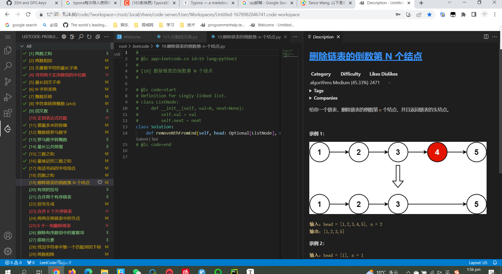

补充：code-server不限于在刷leetcode场景。code-server本质上和vscode一致，因此基于浏览器的code-server可以实现任何vscode可以实现的场景。如果**仅仅想搭建code-server也可以此文章作为参考**。

## 构建

### 1 搭建服务器

#### 1.1 首先购买一台云服务器

可以选择ECS或者轻量级应用服务器。作者在淘宝上以一个很便宜的价格购买了一台腾讯云的轻量级应用服务器。

#### 1.2 为服务器安装系统

安装ubuntu22.04系统

#### 1.3 修改密码

控制台登录用户为lighthouse，直接可以修改root的密码（腾讯云是如此，其他版本的系统请自行google），root密码尽量设置的复杂一些，中美贸易战的背景下网络攻击很多，如果服务器被当成肉鸡了，你会被请去喝茶的。

#### 1.4 开启root远程登录权限

修改 `/etc/ssh/sshd_config` 文件在最后添加 PermitRootLogin yes字样，如图所示

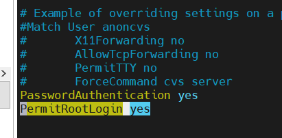

#### 1.5 重启sshd

执行 `systemctl restart sshd` 即可重启sshd

此处关于服务器相关的部分已经搭建完成。

### 2 搭建code-server

注意2.1安装和2.2安装时并行的，两者安装任意一个即可。

#### 2.1 顺利安装code-server

这里是code-server的git仓库，在readme中有安装教程：https://github.com/coder/code-server

安装命令

```bash
curl -fsSL https://code-server.dev/install.sh | sh -s -- --dry-run
```

执行完毕后运行code-server 直接在命令行中输入 `code-server` 即可

如果输入code-server命令，程序正常启动，那请跳过2.2节。

如果报错，如下图所示，请参考2.2节

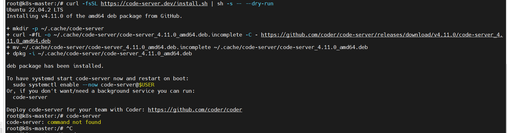

#### 2.2 不顺利安装code-server

大部分人应该都是不顺利安装code-server的。在这里插一句，中国的程序员要想做出一件事情必须拿出**唐僧取经**的精神。记得我第一次用服务器的时候，就接触到了**换源**，中国地方很大，网络也很复杂，所以有些网络不通很正常。做一个事情的每一步可能都会遇到各种各样的妖魔鬼怪，那我们就一点一点解决掉这些妖魔鬼怪吧。

插完了，我们继续。

##### 2.2.1 分析问题

分析2.1图中的报错。大概的意思是我们要去下载一个东西，然后安装它就行了。看着打印出来的日志现实code-server已经安装完毕了，但是实际运行code-server告诉我们没有安装。所以大概有两个原因

​				1、安装实际是失败的，打印日志有问题

​				2、运行命令不是code-server

##### 2.2.2 解决问题

手动去执行一下这些命令mkdir和mv两步我们就不执行了，这个关系不大。重点执行curl这个获取命令。

```bash
curl -O https://github.com/coder/code-server/releases/download/v4.11.0/code-server_4.11.0_amd64.deb
```

执行上述命令，来手动下载镜像包。

执行结果如下图

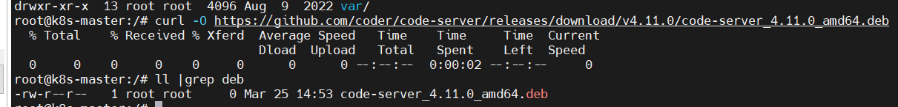

发现下载速度是0，下载完的文件大小也是0。因此问题找到了，因为网络原因（某个路由主动关闭链接）导致实际上文件没有下载成功，自然也就安装失败了。因此只需要把我们需要的`code-server_4.11.0_amd64.deb` 这个文件搞下来就行了。

网址有了，文件路径有了，那你得自己想办法搞吧。（github大文件限制在100M以内，仓库无法传输此文件） 

将文件上传到服务器上即可

##### 2.2.3 安装code-server

```bash
 dkkp -i code-server_4.11.0_amd64.deb
```

执行上面的命令 进行安装即可，安装完毕执行`code-server`命令发现code-server可以正常运行

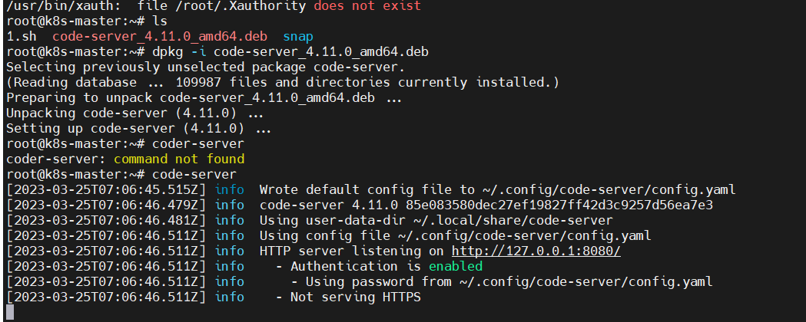

#### 2.3 修改code-server配置

配置文件位置在2.2.3 已经打印出来了，因此执行 `vi ~/.config/code-server/config.yaml` 进行编辑即可，将绑定的地址改为127.0.0.1改为0.0.0.0即可。然后重启code-server，记住这个password，后面需要用到

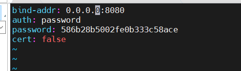

#### 2.4 放行防火墙和安全组

##### 2.4.1 放行防火墙

ubuntu默认使用ufw作为防火墙管理工具。code-server使用的8080端口，因此需要把8080端口进行放行。

放行8080端口命令

```bash
 ufw allow 8080
```

查看端口是否开放

```bash
 ufw status
```


可以看到8080 端口已经放行了

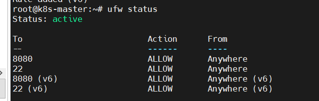

##### 2.4.2 开放安全组

在防火墙选项中添加规则，输入8080端口后确认即可。（作者用的是轻量级应用服务器，如果是ECS对应的防火墙名字叫安全组，配置类似）

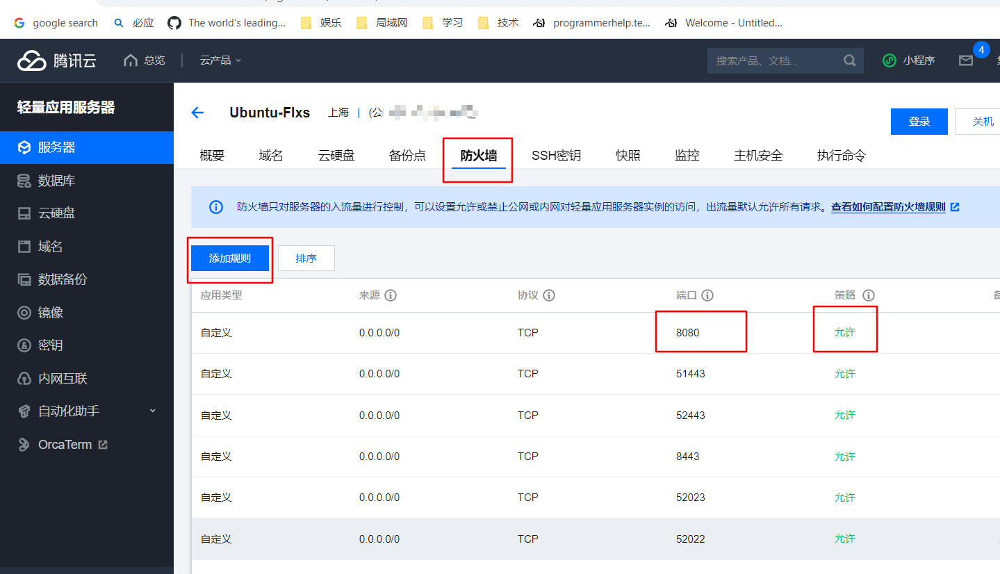

#### 2.5 验证

此时我们通过浏览器已经能访问code-server了

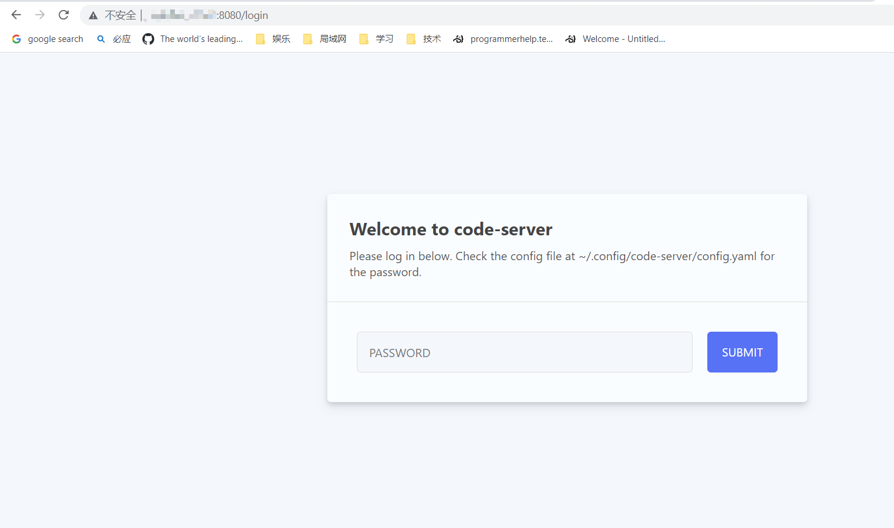

password是刚刚配置文件`~/.config/code-server/config.yaml` 里的password

截止到这个地方code-server的基础版已经搭建完毕了，自行判断到此是否满足了各位哥哥的需求。

### 3、安装leetcode

直接在code-server里面搜索是找不到leetcode的，因此需要离线安装。可以自行去微软插件官方平台下载最新的leetcode插件，也可以使用仓库里面已经下载好的leetcode离线插件。我建议使用仓库中的插件。仓库地址：https://github.com/Tance/docs 的 consturct-code-server/dist 文件夹下。

#### 3.1 上传插件到服务器

#### 3.2 安装

前端按照如图所示的顺序选择即可

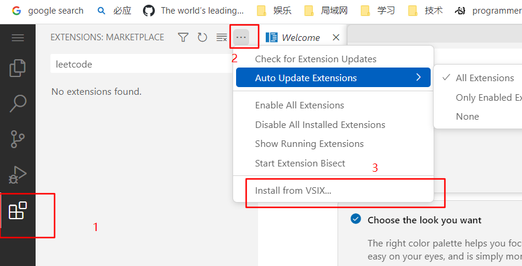

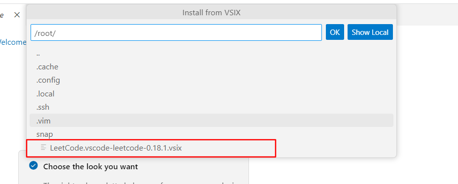

#### 3.3 安装nodejs

点击左边leetcode插件图标，发现右侧报错，leetcode需要安装nodejs才能使用。

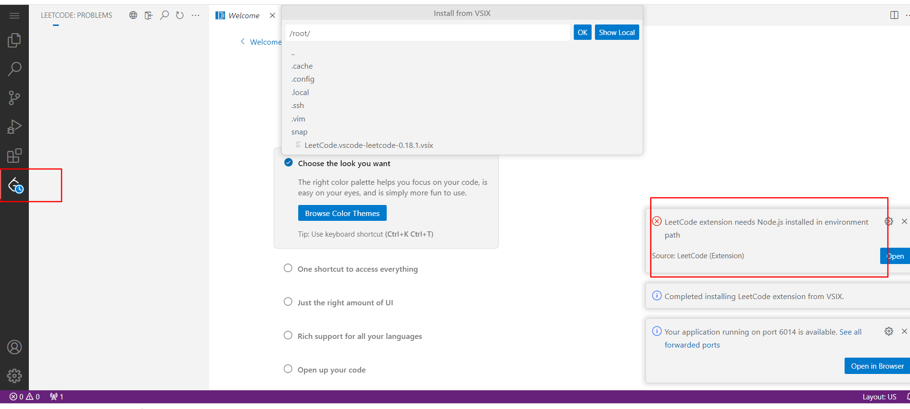


安装nodejs

```bash
 sudo apt install nodejs npm
```

安装完毕后，重启code-server

#### 3.4  登录

打开浏览器，点击leetcode插件发现提示需要登录。

先点击地球图标，将leetcode设置为中国版本，不做这一步你会一直登录失败

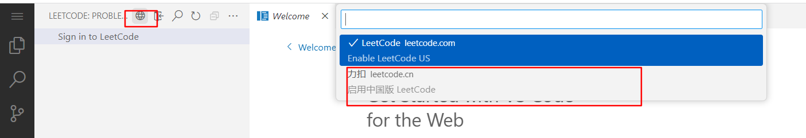

然后输入用户名再输入密码登录即可。

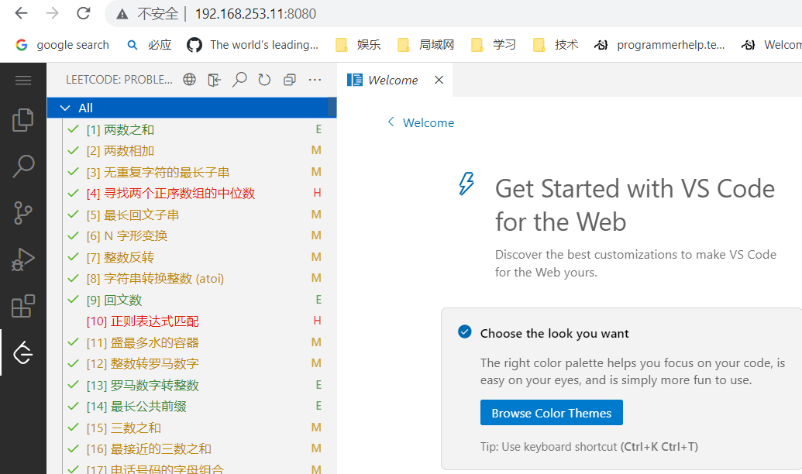

#### 3.5 获取题目

点击获取题目的时候发现是空白的，前端控制台有大量报错，后端也有报错。

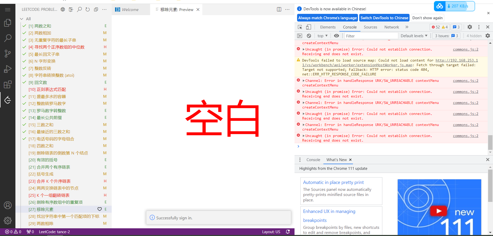


原因是链接code-server的时候需要使用ssl加密的链接，因此我们需要用nginx做反向代理，并签发证书

### 4 签发证书

签发证书有多重方式，例如使用openssl来签发证书。然而不行的是openssl签发的证书并不完全，现在一般都要求x509证书，而且要有sub主题。基于openssl签发的方式太麻烦，因此需要外部工具。这里介绍两个外部工具

1、certbot 可以签发三个月的ssl证书。不过每天都可以请求重新签发，因此实际上永远不会过期。另外这个工具签发的证书可以被所有的浏览器认可，不需要导入根证书。缺点就是没有办法签发纯ip的证书，因此你需要有个域名，但是如果你用域名形式访问服务器的话就需要备案！！备案周期只少半个月（作者在江苏实测）。

2、mkcert 可以签发纯ip证书，但是因为根证书是随机生成的，所以需要在所有用的的机器上信任其根证书。不然浏览器就会显示不安全的提醒。

作者这里使用第二种演示（因为作者的域名备案还没下来，没法使用第一种作为演示）

这边是mkcert的git仓库 https://github.com/FiloSottile/mkcert

#### 4.1 安装mkcert

因为我们用的是ubuntu，所以直接apt install mkcert就可以了

#### 4.2 签发证书

生成服务器的公钥和私钥

```bash
mkcert {your server ip}  
```

执行结果如图所示

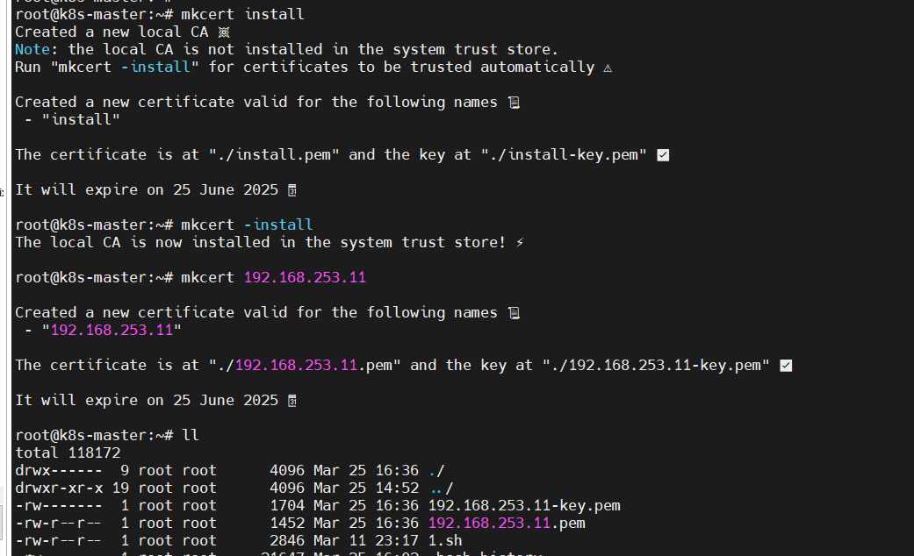


192.168.253.11-key.pem 是 签发私钥， 192.168.253.11.pem 是公钥

#### 4.3 信任根证书

查找根证书的位置

```bash
mkcert -CAROOT
```

里面有两个文件分别是rootCA-key.pem  rootCA.pem，key是秘钥，不带key的是公钥

下载rootCA.pem 重命名为 rootCA.crt

解释一下 pem代表是加密的东西，可能是key，可能是crt。crt是证书的意思，csr是证书签发请求，key一般指私钥。

安装的时候记得把安装位置选为受信任的根证书签发者。如图所示


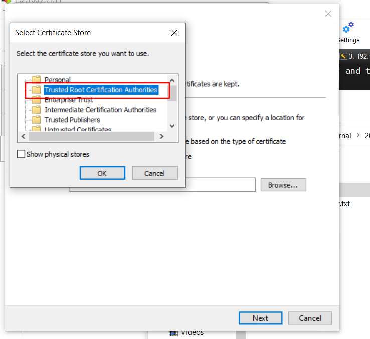

至此证书就签发完毕了，此证书是通用的，如果有别的场景也有签发证书的需求，也可以使用这个方式。

### 5 安装nginx做反向代理

安装nginx**只能用编译安装**的方式，apt install 的nginx不带ssl的模块。

#### 1、下载nginx源码

1.23.3已经是现在最新的版本了，读者可以根据自身的需要自行选择版本

```bash
wget http://nginx.org/download/nginx-1.23.3.tar.gz
```

#### 2、解压并配置

解压

```bash
tar -zxvf nginx-1.23.3.tar.gz
```

配置之前需要安装 pcre和zlib，即执行

```bash
sudo apt-get install libpcre3 libpcre3-dev zlib1g-dev
```

然后执行配置

```bash
./configure --prefix=/usr/local/nginx --with-http_ssl_module
```

如果不安装对应的库就会报错，例如提示缺少pcre，这东西主要是正则表达式相关的

```bash
./configure: error: the HTTP rewrite module requires the PCRE library.
You can either disable the module by using --without-http_rewrite_module
option, or install the PCRE library into the system, or build the PCRE library
statically from the source with nginx by using --with-pcre=<path> option.
```

缺少zlib报错

```bash
./configure: error: the HTTP gzip module requires the zlib library.
You can either disable the module by using --without-http_gzip_module
option, or install the zlib library into the system, or build the zlib library
statically from the source with nginx by using --with-zlib=<path> option.
```

#### 3、安装

```bash
make install
```

#### 4、验证

```bash
/usr/local/nginx/sbin/nginx
```

执行上面命令，查看80端口是否开放，作者的端口是开放的

结果如下

```bash
root@k8s-master:~/nginx-1.23.3# /usr/local/nginx/sbin/nginx
root@k8s-master:~/nginx-1.23.3# netstat -antp|grep nginx
tcp        0      0 0.0.0.0:80              0.0.0.0:*               LISTEN      16417/nginx: master

```

#### 5、设置开机自启以及配置nginx作为服务

在 `/lib/systemd/system` 目录下增加一个`nginxd.service` 文件，文件内容如下

```bash
[Unit]
Description=nginx
After=network.target
 
[Service]
Type=forking
ExecStart=/usr/local/nginx/sbin/nginx -c /usr/local/nginx/conf/nginx.conf
ExecReload=/usr/local/nginx/sbin/nginx -s reload -c /usr/local/nginx/conf/nginx.conf
ExecStop=/usr/local/nginx/sbin/nginx -s quit
PrivateTmp=true
 
[Install]
WantedBy=multi-user.target

```

#### 6、重启systemctl

```bash
systemctl daemon-reload
```

#### 7、用systemctl启动nginx服务

首先要杀死之前的nginx，不然端口无法绑定

首先创建nginx用户

```bash
groupadd -r -g 2023 nginx && useradd -r -m -s /sbin/nologin -u 2023 -g 2023 nginx
```

然后启动nginx

```bash
systemctl start nginxd.service
```

设置开机自启

```bash
systemctl enable nginxd.service
```

#### 8、配置nginx做反向代理

目前code-server监听的是8080端口，我们将让nginx监听443端口，然后将接收到的数据转发到8080端口即可。


```bash
# 做一下映射
map $http_upgrade $connection_upgrade {
     default upgrade;
     '' close;
    }

    server {
    listen       443 ssl;
    server_name  192.168.253.11;

    ssl_certificate      /root/192.168.253.11.pem; # 这个第四步签发的证书
    ssl_certificate_key  /root/192.168.253.11-key.pem; # 这个是证书的私钥

    ssl_session_timeout  5m;

    location /code/ { # 注意目录位置，这个访问code才会到 code-server，因为作者的服务器上起了多个服务
        proxy_pass http://localhost:8080/;  # code-server监听端口
        # 下面的不要动
        proxy_http_version 1.1;
        proxy_set_header Host $host;
        # 下面这两行是关键
        proxy_set_header Upgrade $http_upgrade;
        proxy_set_header Connection $connection_upgrade;
    }
   }
   
} # 这个括号是自带的最后一个括号
```

配置完了之后重启nginx

```bash
systemctl restart nginxd.service
```

打开chrome 访问下面的网址

```
https://192.168.253.11/code
```

显示下图，大工搞成

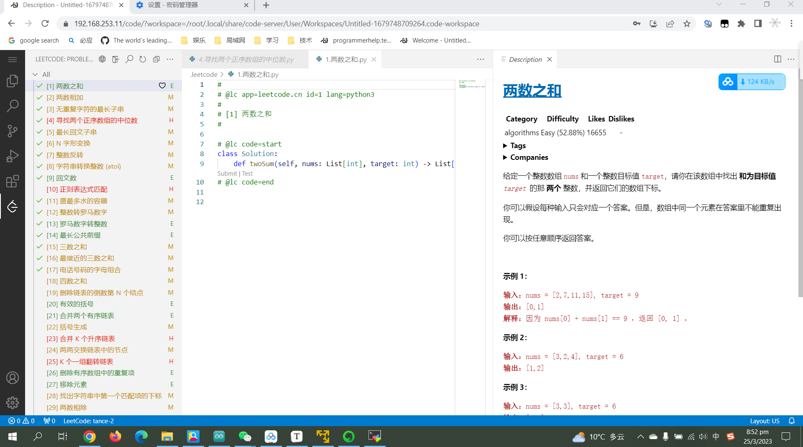


## 总结

今天我们学到了哪些知识？

1、sshd相关的配置

2、ubuntu防火墙相关的知识

3、签发证书

4、nginx反向代理的知识

## 补充

1、为什么code-server建议自己下载，但是leetcode插件使用仓库自带

​			答复：code-server带了版本号，所以即使读者自行下载也不会出现版本问题。leetcode插件下载无法保证版本一致。因此看似相同的两个东西，却推荐不同的下载方式。

## 许可证

任何未经授权的团体不可转载、复制、修改或发行此文章，不可用于任何形式的商业行为。

任何未经授权的个人不可转载或发行此文章，不可用于任何形式的商业行为。

获取授权和商务合作请联系：531519335@qq.com

文章纠正和疑惑解答请联系：531519335@qq.com


已经获得授权的实体有：